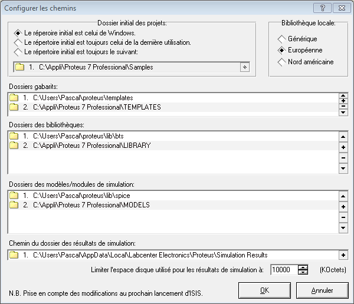
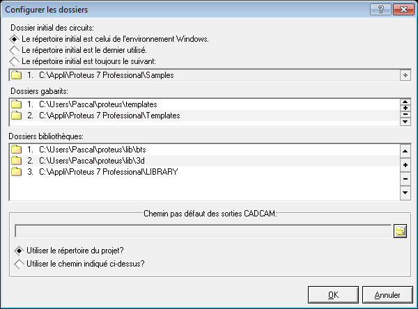

# proteus-lib

_Librairies et modèles pour PROTEUS ISIS et ARES_

Il est nécessaire de configurer correctement le logiciel PROTEUS. Dans PROTEUS, les composants sont mémorisés dans des fichiers librairies. Il existe 3 types de librairies :

* Celles qui contiennent uniquement des symboles utilisés dans le logiciel ISIS.  
* Celles qui contiennent les empreintes que vous placerez sur le PCB à l'aide du logiciel ARES.  
* Celles qui contiennent l'association des symboles et des empreintes utilisés pour faire le lien entre symboles et empreintes (un même symbole peut avoir plusieurs empreintes). **C'est ce qu'on appelle un composant dans PROTEUS**.  

PROTEUS fournit un grand nombre de librairies que vous pouvez trouver dans le dossier LIBRARY du répertoire d'installation du logiciel (`C:\Program Files\Labcenter Electronics\Proteus 7 Professional`). **Il n'est pas conseillé de mettre vos librairies personnelles dans ce dossier**.

En plus des librairies, PROTEUS fournit des modèles de PCB (templates en anglais) qui permettent de commencer rapidement le travail de placement sur un contour de carte pré-établi.

1. Rendez vous dans le dossier `LIBRARY` de PROTEUS et supprimer tous les fichiers commençant par btsse

2. Dans votre dossier « Mes Documents », ouvrez une fenêtre git bash et cloner le dépôt :

        git clone https://github.com/epsilonrt/proteus-lib.git

3. Lancez ISIS et ajouter les chemins (Menu : `Système>Définir chemins...`) de votre dossier `proteus-lib/lib/bts` dans la liste «Dossiers des bibliothèques», de votre dossier `proteus-lib/templates` dans «Dossiers des gabarits » et de votre dossier `proteus-lib/lib/spice` dans «Dossiers des modèles de simulation ».
** <IMPORTANT> Placez ces chemins en première position dans la liste conformément à l'image ci-dessous** :

4. Faites de même dans ARES pour les dossiers `proteus-lib/lib/bts` et `proteus-lib/lib/3d` dans «Dossiers des bibliothèques » et `proteus-lib/templates` dans «Dossiers des gabarits » (En effet, les chemins ne sont pas communs entre ISIS et ARES…) :

